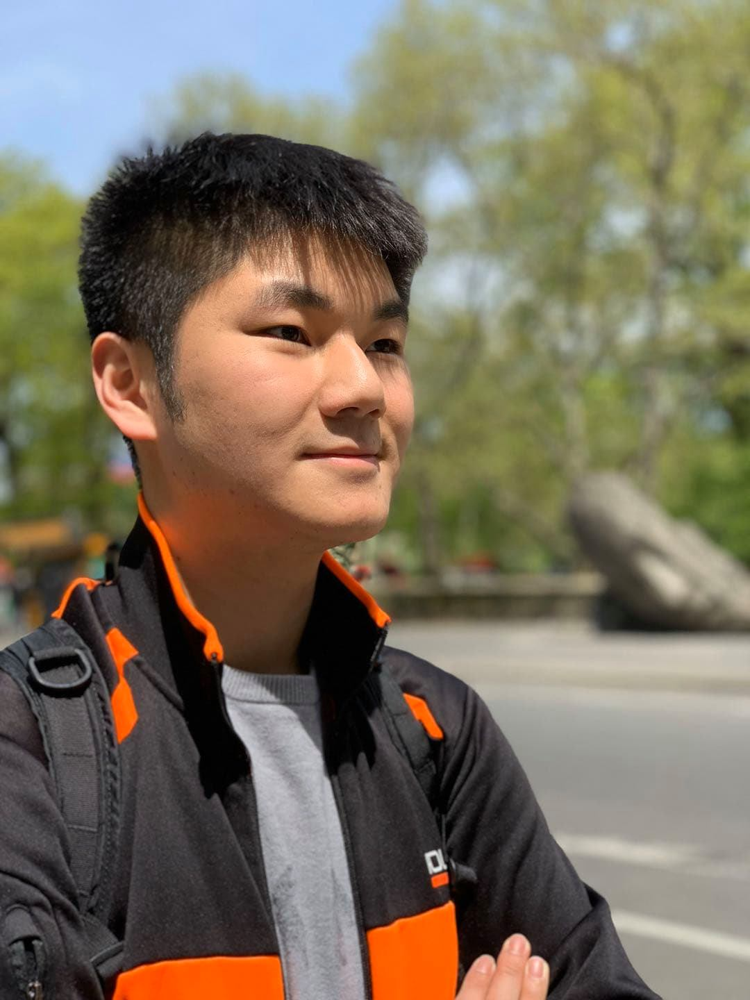

* content
{:toc}

I am a 5th-year undergraduate student at Northeastern University majoring in computer science and mathematics. Research is my passion and the areas I am interested in are machine learning and computational biology. More specifically, I am interested in finding ways to incorporate recent advances in machine learning such as deep learning to the biological/medical domain where data imbalances/noisiness are significant and model interpretability is crucial. Currently I am a member of [Radivojac Statistical Methods's lab](https://www.ccs.neu.edu/home/radivojac/) and in the past I have been a software engineer at [Chewy](http://chewy.com) and [BlockTEST](https://blocktest.com/). Check out the demo page for some of the works I have done!

## Awards and Honors
* [Civic Digital Fellow](https://www.codingitforward.com/fellowship), hosted by the National Institutes of Health (NIH), 2020
* Dean's List, Northeastern University Khoury College, 2016-2020

## Links
* Email: hoyinchu2016 at gmail.com
* [Resume](../asset/pdf/Hoyin_Chu_Resume.pdf)
* [Linkedin](https://www.linkedin.com/in/hoyin-chu-65b411137/)
* [Github](https://github.com/hoyinchu)
* [DevPost](https://devpost.com/hoyinchu)

## Fun
* [Chess](http://www.masschess.org/chess_horizons/chess-horizons-article.aspx?ch_uid=249)
* [Games](https://globalgamejam.org/users/hoyinchu)
